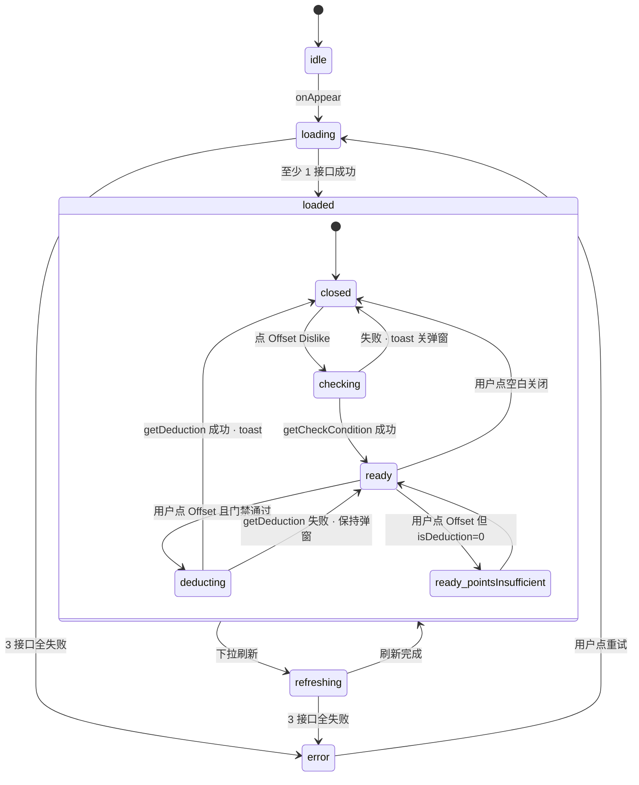

# DS · 数据统计页（DataStatisticsView）Spec — 2026-07-17

对齐 H5 蓝本 `views/dataStatistics/index.vue`，作为 Work 页顶部 Detail 按钮点击目标。

- **里程碑代号**：`DS`（DataStatistics 缩写；不属于路线图 A→J 主线，是 Downloads UI 增强类"补齐 H5 蓝本已有但 iOS 缺"的加项）
- **依赖**：无强前置；复用 Work.WorkRoute + AppToastCenter + APIClient 现有基建
- **不阻塞**：任何主路线里程碑
- **档位**：**A 档**（5 接口 · offset 抵扣二次流 · 5+ 状态机态）

---

## §0 · 范围三圈占位判断

按 rule `feature-pipeline-complexity-tier` §0.3 preflight：

| 内圈（本次做） | 中圈（下次做） | 外圈（不做） |
|---|---|---|
| 完整 `DataStatisticsView`（Total Dislike Rate / Weekly Level / Current Level Benefits）· Offset 抵扣弹窗流 · Dislike Rate tooltip · Work.detailPill push 接线 · 三语 banner 图接入 | Profile.tierBlock 路由改指向 DataStatisticsView（H5 里 mine 也跳同页；iOS 目前 tierBlock → LevelDetailView 段位光谱是 iOS 差异化产物，保留待用户拍板） | mine 页 CNavBar right 图标接入（iOS mine 页目前无此位置对应）· 服务端埋点上报（H5 也未打）· 抵扣成功后主动重拉 getDataPreview 刷新 UI（H5 未做，本次也不做） |

**preflight grep 结果**：

- `Sources/Networking/APIClient.swift` 已提供 `.post(path, body:)`，参考 `LiveDataService`
- `Sources/Core/UI/AppToastCenter.swift` 提供 `Toast.dismissDurationNanos` + `.toastStyle()`
- `Sources/Work/WorkView.swift:204 WorkRoute` 已有 route 注册模式，新增 `.dataStatistics` case
- 无自持相机/自持 store/ignoresSafeArea 关联组件复用风险（rule `cross-scene-component-reuse-preflight`）

结论：**内圈可直接落地，无额外依赖抽取**。

---

## §1 · H5 蓝本二次校验（信源真相）

### §1.1 · 接口 5 契约（signal source: `src/api/datePreview/index.ts` 字面 + view 消费点）

| # | 接口名 | Path（字面） | Method | Body | 触发时机 |
|---|---|---|---|---|---|
| 1 | getDataPreview | `/api/chat/dataPreview` | POST | 空对象 `{}` | onMounted |
| 2 | getAnchorAutoLevelUpInfo | `/api/anchor/anchorAutoLevelUpInfo` | POST | 空对象 `{}` | onMounted |
| 3 | getGetLevelConfig | `/api/chat/getLevelConfig` | POST | 空对象 `{}` | onMounted |
| 4 | getCheckCondition | `/api/chat/checkCondition` | POST | 空对象 `{}` | 点 Offset Dislike 按钮 |
| 5 | getDeduction | `/api/chat/deduction` | POST | 空对象 `{}` | 弹窗 confirm 且 checkCondition 门禁通过 |

**关键点**：
- **接口 2** 的 module 是 `/api/anchor/*`（不是 `/api/chat/*`），路径必须字面对齐（rule `api-http-method-strict`）
- **接口 5** 的 body **不携带任何** checkCondition 返回字段 —— 后端从 session/token 推导抵扣主体

### §1.2 · Response 字段（信源：view 消费点 + type.ts 交叉验证）

⚠️ **H5 type.ts 类型声明与实际用法不一致**（rule `ios-decode-userid-compat`）：
- `dataPreviewData` type 声明为**数组**（`http.post<dataPreviewData[]>`），实际返 **对象**（view 直接 `res.likes / res.disLikes / res.dislikeRate`）
- **信源码，不信 type.ts**

| # | 接口 | 消费字段（H5 view 直接读的） | 字段类型（推断） | 空值兜底 |
|---|---|---|---|---|
| 1 | dataPreview | `likes` / `disLikes` / `dislikeRate` | Number；dislikeRate 可能是 `"50.10%"` 字符串（`deleteZeroUtil` 里 `.toString().includes('.')`） | 初值 0 |
| 2 | anchorAutoLevelUpInfo | `levelDataConfVos.{levelAnswerRatePreveiw, levelAnswerRateLast, avgDurationPreveiw, avgDurationLast, levelCallsPreveiw, levelCallsLast, levelUpdateTimePreveiw, levelUpdateTimeLast}` ⚠️ **拼写 "Preveiw" 非 "Preview"** | Number 或 String（duration 是秒；updateTime 是 ISO 字符串取前 10 位当日期） | 空显示 `-` |
| 3 | getLevelConfig | `gradeEquityHave: [String]` / `gradeEquityNone: [String]` | 字符串数组（虽然 `:key="item.key"` 暗示对象，实际 undefined，等价 String 数组渲染） | 空数组不渲染 |
| 4 | checkCondition | `isDeduction`（`===0` 严格等）/ `anchorIntegral` / `integrate` / `deduction` | isDeduction 是 Number；其他 3 项可能 Number 或 String | `\|\| '0'` 兜底 |
| 5 | getDeduction | **零字段消费**（H5 只用 resolve 语义 → showToast） | — | — |

**iOS Codable 策略**：按 rule `agent-recon-field-names-unverified`：
- 所有数值字段用 **Double + String 双兼容 decode**（`decodeIfPresent(String.self) ?? String(Double)`），前端展示时保 String 精度
- 真机首次拉取后按 `AppLogger` log 校准每个字段的实际类型（后端返 Number 还是 String）
- `isDeduction` 严格 Int 兼容（NSNumber Bool 陷阱 rule `ios-decode-userid-compat` 排除 `objCType == "c"/"B"`）

### §1.3 · UI / 交互 flow

**视觉结构**（对齐 [`views/dataStatistics/index.vue`](../../anchor-livechat-h5/src/views/dataStatistics/index.vue)）：

```
CNavBar（仅返回箭头 · 无 title 无 right slot · ar 语言箭头翻转）
├─ 主体（px-16 py-20 · 深色继承 body）
│  ├─ Banner img（w-full rounded-14 · 三语差异）
│  ├─ TitleBar #1: "Total Dislike Rate" + ⓘ 问号 + 「Offset Dislike >」按钮
│  ├─ 三卡行（gap-10）: Likes / Dislikes / Rate
│  │    - flex-1 rounded-12 bg-#2B213E p-10
│  │    - icon 20×20 mb-8
│  │    - 数值 text-24 font-500 lh-26（色 #FF6A45 / #37CAFF / #61FF93）
│  │    - 标签 text-12 lh-28 白 0.7
│  ├─ TitleBar #2: "Weekly Level" + subTitle "(Only private and live calls are calculated)"
│  ├─ 周对比表（rounded-12 bg-#2B213E p-[12px_20px]）
│  │    - 表头（黄 #FFE600）: Category(1.5) · Week(1) · Last Week(1)
│  │    - 分隔线 h-1 bg-[rgba(0,0,0,0.4)]
│  │    - 4 行数据（首列白 0.7 左对齐 · 后两列白居中 · mb-20 除末行）
│  ├─ TitleBar #3: "Current Level Benefits"
│  └─ 权益列表（rounded-12 bg-#2B213E p-[12px_20px]）
│       - have 项: text-14 白 pb-8 + ✓ 图 24×24
│       - none 项: text-14 白 + ✗ 图 24×24
└─ CThemePopup Offset 弹窗（模态）· CThemePopup Dislike Tooltip（模态）
```

**Offset Dislike 交互 flow**（H5 `showOffset` / `submitOffset`）：

1. 用户点 Offset Dislike → `showOffset()` 打开弹窗**同时**请求 `getCheckCondition`（弹窗立即打开，接口回来更新内容）
2. 弹窗内容：
   - Header: "Remove Dislike"
   - Content: 长描述 + Current Points: {anchorIntegral} + Remaining removal times: {integrate} Points / {deduction} Chances Remaining
   - Footer: 单按钮 "Offset"（`@click-fun` 只关闭弹窗，不直接提交）
3. **真正提交走 `@before-close="submitOffset"` 钩子**：
   - action === `'confirm'` 且 `btnOffset === true`（isDeduction ≠ 0）→ 请求 `getDeduction` → 成功 toast "You've offset one dislike" + resolve(true) 关闭
   - action === `'confirm'` 但 `btnOffset === false`（isDeduction === 0）→ toast "Your points are insufficient" + resolve(false) **阻塞关闭**（弹窗保持打开）
   - action !== `'confirm'`（用户点空白 / 系统关闭）→ resolve(true) 允许关闭
4. **成功后不主动刷 getDataPreview**（H5 未做，本次也不做；rule 保持一致）

**Dislike Rate tooltip**：点 ⓘ 问号 → 弹窗（Header "Dislike Rate" + 长描述 + 确认按钮关闭），无接口调用。

### §1.4 · i18n key 清单（复用 H5 key，iOS L10n 需新增）

| iOS L10n key（拟） | H5 key | 英文原文 |
|---|---|---|
| `dataStats.totalDislikeRate` | `hostDashboard.total dislike rate` | Total Dislike Rate |
| `dataStats.offsetDislike` | `hostDashboard.offset dislike` | Offset Dislike > |
| `dataStats.removeDislike` | `hostDashboard.remove dislike` | Remove Dislike |
| `dataStats.removeDislikeDesc` | `hostDashboard.remove dislike desc` | (长描述文本，来自 en.json 完整原文) |
| `dataStats.dislikeRate` | `hostDashboard.dislike rate` | Dislike Rate |
| `dataStats.dislikeRateDesc` | `hostDashboard.dislike rate desc` | (长描述文本) |
| `dataStats.likes` | `hostDashboard.likes` | Likes |
| `dataStats.dislikes` | `hostDashboard.dislikes` | Dislikes |
| `dataStats.weeklyLevel` | `hostDashboard.weekly level` | Weekly Level |
| `dataStats.weeklySubtitle` | `hostDashboard.calculate only private and live calls` | (Only private and live calls are calculated) |
| `dataStats.levelAnswerRate` | `hostDashboard.level answer rate` | Level Answer Rate |
| `dataStats.levelAvgDuration` | `hostDashboard.level avg duration` | Level Avg Duration |
| `dataStats.levelCalls` | `hostDashboard.level calls` | Level Calls |
| `dataStats.levelUpdateTime` | `hostDashboard.level update time` | Level Update Time |
| `dataStats.currentLevelBenefits` | `hostDashboard.current level benefits` | Current Level Benefits |
| `dataStats.currentPoints` | `points.current points` | Current Points |
| `dataStats.remainingRemovalTimes` | `points.remaining removal times for this week` | Remaining removal times for this week |
| `dataStats.pointsRemainingChancesFormat` | `points.points remaing chances` | %@ Points / %@ Chances Remaining |
| `dataStats.offset` | `points.offset` | Offset |
| `dataStats.pointsInsufficient` | (H5 硬编码) | Your points are insufficient |
| `dataStats.offsetSuccess` | (H5 硬编码) | You've offset one dislike |
| `common.confirm` | `common.confirm` | Confirm（可能已存在，复用检查）|
| `common.category` | `common.category` | Category |
| `common.week` | `common.Week` | Week |
| `common.lastWeek` | `common.last week` | Last Week |

**注**：`points.points remaing chances` H5 拼写错误 "remaing"（应 "remaining"），iOS key 拼写修正，英文原文保留 H5 一致（`%@ Points / %@ Chances Remaining`）。

### §1.5 · 三语 banner 资源

H5 三张图（`/Users/joe/Desktop/HN/anchor-livechat-h5/src/assets/datePreview/`）：
- `mine-banner-ar.png` — 阿拉伯语
- `mine-banner-tr.png` — 土耳其语
- `mine-banner.webp` — en 默认

**iOS 方案**：转拷进 `Assets.xcassets`（Asset Catalog 三个 imageset：`dataStatsBanner`（en/默认）· `dataStatsBanner-ar` · `dataStatsBanner-tr`）；view 层按 `AppLocale.current` 选图。

**替代方案**：若切图暂时不便入库，可用 iOS 原生渐变 header（无图）占位，rule 允许阶段性方案（H5 视觉不 pixel-perfect）。

### §1.6 · 死代码/撒谎信号识别

- `views/dataStatistics/config.js` 未被 `index.vue` import，是**死代码**（离线示例数据），iOS 忽略
- `api/datePreview/index.ts` 中 `getDataPreview` type 声明 `dataPreviewData[]` 与实际用法冲突 —— **type 撒谎，不是死代码**
- `getCheckCondition` 返回的 `res.deduction` 与函数名 `getDeduction` 撞车易混淆 —— iOS Codable 用 `chancesRemaining` 语义命名避免歧义

---

## §2 · iOS 现状 + 复用判断

### §2.1 · 现有对齐点

- **Work.WorkRoute enum**（[WorkView.swift:204](../../Sources/Work/WorkView.swift#L204)）—— 添加 `.dataStatistics` case
- **WorkView.WeeklyLevelHeader.detailPill**（[WeeklyLevelHeader.swift:96](../../Sources/Work/Components/WeeklyLevelHeader.swift#L96)）—— 从纯视觉 View 改为 `NavigationLink(value: WorkRoute.dataStatistics)`
- **APIClient.shared.post** —— 复用现有 `.post(path, body:)`
- **AppToastCenter** —— 复用 `showToast(message:)`
- **AppLocale.current** —— banner 三语切换基座
- **AnchorInfoStore + LevelDetailView 保留不变**（Profile.tierBlock 保持指向 LevelDetailView 段位光谱页）

### §2.2 · 命名与位置

- 目录：`Sources/Work/DataStatistics/`
- 文件：
  - `DataStatisticsView.swift`
  - `DataStatisticsStore.swift`
  - `DataStatisticsService.swift`
  - `DataStatisticsModels.swift`
  - `Components/DislikeRateCard.swift`
  - `Components/WeeklyLevelTable.swift`
  - `Components/CurrentLevelBenefitsList.swift`
  - `Components/OffsetDislikeDialog.swift`
  - `Components/DislikeRateTooltipDialog.swift`
- 参考模板：`Sources/Work/LiveData/*.swift` 目录结构

### §2.3 · Profile.tierBlock 与本页关系（待用户拍板）

**H5**: mine 页 + work 页多个入口都跳 `/dataStatistics` 同一页。

**iOS 当前**: `ProfileRoute.levelDetail → LevelDetailView`（段位彩虹光谱，iOS 加的差异），与 H5 dataStatistics 页内容不重叠。

**决策候选**：
- **候选 A（推荐）**：保留 Profile.tierBlock → LevelDetailView 不变；Work.detailPill → **新** DataStatisticsView。理由：Profile 段位区强调"段位"，Work Detail 强调"数据"，语义分层清晰；LevelDetailView 是 iOS 差异化设计有独立价值
- **候选 B**：统一 Profile.tierBlock 也改指向 DataStatisticsView，删除 LevelDetailView。理由：完全对齐 H5

**默认走 A**；用户 spec 审批时可翻案。

---

## §3 · 状态机

### §3.1 · 页级 state（DataStatisticsStore.State）

```
enum LoadState {
    case idle                    // 初始（onAppear 前）
    case loading                 // 3 接口并行拉取中
    case loaded(payload)         // 至少 1 个接口成功；每子块允许 nil 内部兜底 UI
    case error(message)          // 3 接口全失败才进 error（fail-independent）
    case refreshing(payload)     // 下拉刷新中，保留旧 payload 视觉（rule list-refresh-preserve-items）
}
```

**并行策略**：三个 onMounted 接口用 `async let` 并行触发 + `try? await`（对齐 H5 `allSettled` 语义，任一失败不阻塞其他）。任一接口 loaded 即进 `.loaded(payload)`；三个都失败进 `.error`。

**payload 结构**：
```
struct Payload {
    var dislike: DislikePreview?        // getDataPreview 结果
    var weekly: WeeklyLevelInfo?        // getAnchorAutoLevelUpInfo 结果
    var benefits: LevelBenefits?        // getGetLevelConfig 结果
    var loadingSubset: Set<Endpoint>    // 哪些接口还在拉
}
```

UI 层：某子块 `nil` 时该 section 显 placeholder 或整块隐藏（对齐 H5 空值 `-` 兜底行为）。

### §3.2 · Offset 抵扣子 state（OffsetDialogState）

```
enum OffsetState {
    case closed
    case checking(dialogVisible: true)     // 弹窗已打开 · getCheckCondition 请求中
    case ready(info: CheckConditionInfo)   // 弹窗打开 · 数据到位
    case deducting(info)                    // 用户按 Offset · getDeduction 请求中
    // 成功/失败后回 closed（成功场景 · 门禁不通过 toast 但不关弹窗保持 ready）
}
```

**门禁分支**（对齐 H5 `submitOffset` action==='confirm'）：
- `info.isDeduction == 0` → toast `pointsInsufficient` + **不关弹窗**（保持 ready）
- `info.isDeduction != 0` → 进 deducting → 成功 toast `offsetSuccess` → closed

### §3.3 · Tooltip 子 state

```
enum TooltipState { case closed, open }
```

纯本地 UI 态，无 IO。

### §3.4 · 状态机迁移图（Mermaid 辅助）



---

## §4 · API 契约（iOS Codable 目标）

### §4.1 · getDataPreview

```
struct DislikePreview: Decodable {
    let likes: Int
    let disLikes: Int
    let dislikeRate: String  // "50.10%" 或数字字符串 · deleteZero 展示层做
    // Number/String 双兼容 decode
}
```

**Path**: `/api/chat/dataPreview` · POST · body `[:]`

### §4.2 · getAnchorAutoLevelUpInfo

```
struct WeeklyLevelInfo: Decodable {
    let levelDataConfVos: LevelDataConfVos?

    struct LevelDataConfVos: Decodable {
        let levelAnswerRatePreveiw: String?  // ⚠️ 拼写 Preveiw
        let levelAnswerRateLast: String?
        let avgDurationPreveiw: Int?         // 秒
        let avgDurationLast: Int?
        let levelCallsPreveiw: Int?
        let levelCallsLast: Int?
        let levelUpdateTimePreveiw: String?  // ISO 字符串取前 10 位
        let levelUpdateTimeLast: String?
    }
}
```

**Path**: `/api/anchor/anchorAutoLevelUpInfo` · POST · body `[:]`

**⚠️ 字段名拼写保留 H5 一致**（"Preveiw" 而非 "Preview"）—— 后端接口以 H5 为准，不改后端契约。iOS 内部 view 层展示用正确拼写"Preview"作为 UI label，只 CodingKeys 保持 wire format 一致。

### §4.3 · getGetLevelConfig

```
struct LevelBenefits: Decodable {
    let gradeEquityHave: [String]
    let gradeEquityNone: [String]
}
```

**Path**: `/api/chat/getLevelConfig` · POST · body `[:]`

### §4.4 · getCheckCondition

```
struct CheckConditionInfo: Decodable {
    let isDeduction: Int        // 0=积分不足，其他=允许抵扣
    let anchorIntegral: String  // 双兼容
    let integrate: String       // 双兼容
    let deduction: String       // 双兼容 · iOS 语义命名 chancesRemaining
}
```

**Path**: `/api/chat/checkCondition` · POST · body `[:]`

### §4.5 · getDeduction

```
struct DeductionResult: Decodable {
    // 无消费字段 · H5 只用 resolve 语义
    // iOS 保留空 struct 供未来后端加字段扩展
}
```

**Path**: `/api/chat/deduction` · POST · body `[:]`

---

## §5 · 验收清单

### §5.1 · 正向路径（F1-F8）

| # | 场景 | 期望 |
|---|---|---|
| F1 | 点 Work 页 detailPill | 推入 DataStatisticsView |
| F2 | 页面加载 3 接口成功 | 三卡 + 周表 + 权益列表全显示；数值按 H5 格式化（rate 去末尾 0、duration 秒转 mm:ss、updateTime 取前 10 位） |
| F3 | 点 Offset Dislike 按钮 | 弹窗弹出；同时后台请求 getCheckCondition，成功后填 anchorIntegral / integrate / deduction |
| F4 | 弹窗 Offset 按钮（isDeduction≠0） | 请求 getDeduction 成功 → toast "You've offset one dislike" → 关弹窗 |
| F5 | 弹窗 Offset 按钮（isDeduction=0） | toast "Your points are insufficient" · 弹窗**保持打开** |
| F6 | 点 ⓘ 问号 | 展示 Dislike Rate 描述弹窗 · Confirm 关闭 |
| F7 | 下拉刷新 | 保留旧数据视觉 · 顶部 spinner · 3 接口重拉 |
| F8 | 阿拉伯 / 土耳其语切换 | banner 图对应语言 · CNavBar 返回箭头方向翻转（rule swiftui-root-draggesture-mindist-zero 不冲突） |

### §5.2 · 反向 / 边界（R1-R12）

| # | 场景 | 期望 | 覆盖手段 |
|---|---|---|---|
| R1 | 3 接口全失败 | 整页 error state · 显重试按钮 | Fakes 单测 + 真机断网 |
| R2 | 只 1 接口失败（如 getDataPreview 失败，另 2 成功） | 页面显示后 2 块 · 失败块显 placeholder 或整块隐藏（对齐 H5） | Fakes 单测 |
| R3 | getDataPreview 返回 `dislikeRate` 为数字（非字符串） | Codable 双兼容 decode 成功 · 展示层 deleteZero | Fakes decode 边界单测（含 `{"dislikeRate": 50.10}` 与 `{"dislikeRate": "50.10%"}` 两种） |
| R4 | anchorAutoLevelUpInfo 缺 `levelDataConfVos` | 周表 4 行全显 `-` | Fakes 单测 |
| R5 | anchorAutoLevelUpInfo 字段拼写返 "Preview" 非 "Preveiw" | 应当失败（后端契约以 Preveiw 为准）· iOS log warning 但不 crash | 真机首次拉取校验 |
| R6 | 弹窗打开时 getCheckCondition 请求进行中，用户点 Offset 按钮 | 忽略点击（deducting 前必须 ready） | Fakes 单测 + Preview |
| R7 | getCheckCondition 失败 | 弹窗关闭 · toast 显 API 错误 | Fakes 单测 |
| R8 | 弹窗打开中，getDeduction 请求进行中，用户重复点 Offset 按钮 | 忽略重复点击（deducting 期间 disable 按钮） | Fakes 单测 |
| R9 | isDeduction 字段类型偷换（返 Bool、String "0"、null） | 兼容 decode + 严格判 `==0` | Fakes decode 边界单测 |
| R10 | gradeEquityHave/None 返 null 或 undefined | 整个 benefits 区块不渲染 | Fakes 单测 |
| R11 | 弹窗打开中用户返回上一页 | 弹窗 dismiss · onDisappear 清 state（rule swiftui-fullscreencover-hoist） | 真机手势 |
| R12 | 快速点 detailPill 多次 | push 单次（NavigationLink debounce）| 真机 |

### §5.3 · 覆盖手段矩阵

反向 R1-R12 每项对应单测/Preview/真机覆盖（Step 1c/2/4 落地时机械对齐）：

| # | 单测 | Preview | 真机 |
|---|---|---|---|
| R1-R2 | ✓ | ✓ error/placeholder 变体 | 断网 |
| R3-R5 | ✓ | — | 首次真机 log 校准 |
| R6-R8 | ✓ | — | — |
| R9-R10 | ✓ | — | — |
| R11-R12 | — | — | ✓ 手势 |

---

## §6 · 复用候选

| 组件 | 位置候选 | 决策 | 理由 |
|---|---|---|---|
| `DataStatisticsView / Store / Service / Models` | `Sources/Work/DataStatistics/` | 内圈 | 单入口 · 未来若 Profile 也接入再抽 Core |
| `TitleBar`（黑底 · 白文 title · 白 0.7 subTitle · 右 slot） | 短期 file-private inside view | 待观察 | 若第 2 个页面复用再抽 `Sources/DesignSystem/TitleBar.swift` |
| `OffsetDislikeDialog / DislikeRateTooltipDialog` | `Components/` 内 file-private | 内圈 | 场景专用弹窗 · 与其他弹窗视觉/交互差异大 |
| banner 三语切换 helper | 页内 file-private | 内圈 | 若发现第 2 处需三语 banner 切换再抽 |

---

## §7 · 待问用户清单（spec 审批 close）

1. **Profile.tierBlock 处理方式**：走候选 A（保留 LevelDetailView 段位光谱页不动）？还是候选 B（Profile.tierBlock 也改指向 DataStatisticsView）？
2. **banner 图接入**：从 H5 目录拷 3 张图到 `Assets.xcassets`（en/ar/tr）？还是用 iOS 原生渐变 header 占位？
3. **抵扣成功后是否主动重刷 getDataPreview**：H5 未做（用户抵扣后要重进页面才见 dislikes 减 1）。iOS 是否保持 H5 行为？还是优化为 Offset 成功后自动重拉 getDataPreview？

---

## §8 · 已知风险 + 相关 rule

| 风险 | 关联 rule | 缓解 |
|---|---|---|
| API method/path 字面错 | `api-http-method-strict` | spec §1.1 已用 H5 字面 path/method，实施前 grep 复核 |
| Response 字段名/类型撒谎 | `agent-recon-field-names-unverified` + `ios-decode-userid-compat` | Codable 双兼容 decode · 真机首次 log 校准 |
| Popup 生命周期与 kb 交互 | `swiftui-fullscreencover-hoist` | sheet/dialog hoist 到唯一容器 · onDisappear 不清副作用 |
| 下拉刷新 rooms 消失 | `list-refresh-preserve-items` | State enum 含 `.refreshing(payload)` · refreshable closure await 到完成 |
| Loading dead-state | `async-state-fallback` | 3 接口 fail-independent · 单接口失败对应块显 placeholder |
| SF Symbol 无效渲染空 | `sf-symbol-usage-preflight` | 用现有已验证 symbol（`questionmark.circle` · `chevron.forward`）不猜新的 |
| Button `.plain` 热区 | `swiftui-button-plain-hitarea` | Offset 按钮 + Confirm 按钮加 `.contentShape(Rectangle())` |
| push 页缺左滑返回 | `default-swipe-back-on-push-pages` | 无自定义 leading · 系统 back 自动挂 swipe-to-pop |
| swiftui body type-check timeout | `swiftui-body-type-check-timeout` | 主 body 分拆各 section computed property |
| `.background(_:in:)` closure error | `swiftui-background-in-shape-signature` | 用 `.background { shape.fill(color) }` view-based 路径 |

---

## §9 · Rules 候选

本 spec 无强制新 rule 需求；step 6 retrospective 时若发现"通用知识缺失"再沉淀。

初判可能沉淀点（先记录，实施时视触发情况决定）：
- 若 Codable 双兼容 decode 出现新组合（如 Bool/Int/String 三态），可扩展 `ios-decode-userid-compat.md` 增补 case
- 若三语 banner 切换涉及非平凡逻辑，考虑抽 `AppLocale` helper 到 Core（当前先 file-private）

---

## §10 · 附录 A · Spec 写作自检清单

- [x] 业务概念词表已列（§1 表格清晰对齐 H5 命名）
- [x] H5 二次校验已完成（§1，含死代码识别）
- [x] 状态机图已画（§3，含子状态嵌套）
- [x] 验收清单正向 + 反向覆盖（§5 F1-F8 + R1-R12）
- [x] 复用候选已标记（§6）
- [x] 待问用户清单已 close 前置项（§7 · 待用户审批时最终 close）
- [x] Rules 候选已识别（§9）
- [x] 已知风险 + rule 关联（§8）

## §11 · 附录 B · 与 LiveDataView 的差异对比

（为帮助 UI 层复用判断时参考）

| 维度 | LiveDataView（Phase B） | DataStatisticsView（DS） |
|---|---|---|
| 入口 | Work Tools 独立入口 | Work 顶部 detailPill |
| 主数据 | 周/月直播时长与收益汇总 · 日期列表 | Dislike Rate + Weekly Level 表 + Level Benefits |
| Segment 切换 | Weekly / Monthly + 子期间下拉 | 无 |
| Popup | 规则说明 sheet | Offset 抵扣弹窗（含门禁）+ Rate tooltip |
| Money bag 浮标 | 有 | 无 |
| 接口数 | 2（authorLiveData + task/v2/get） | 5（并行 3 · 弹窗联动 2） |
| 状态机复杂度 | 中 | 中高（子弹窗 state 嵌套） |

结论：**架构参考 LiveDataView 目录结构**（Models / Service / Store / View + Components），细节差异大不直接抽公共基座。

---

**Spec 到此结束**。待用户签字后进 Step 1a。
